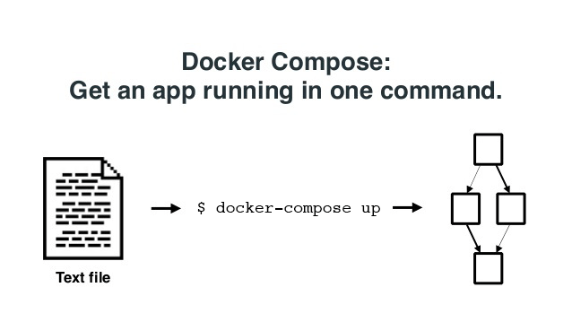
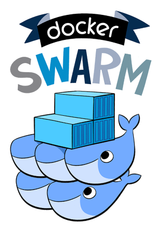
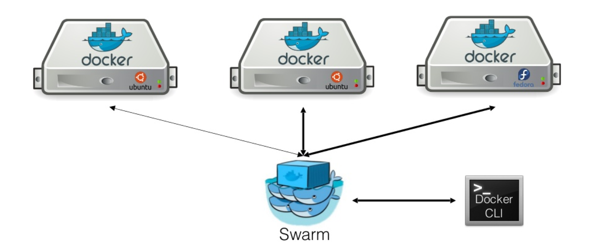
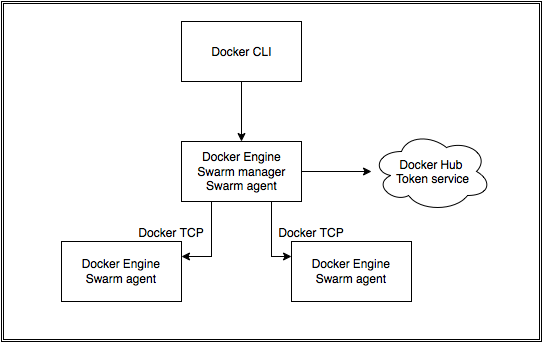

# What is Compose
- Defining and running multi-container applications
- Using a Compose file (docker-compose.yml)


!SUB
# Compose overview



!SUB
# Compose capabilities
- Multiple isolated environments on single host
- Preserve volume data when containers are created
- Only recreate containers that have changed
- Using variables and extending Compose files

!SUB
# Compose file
- docker-compose.yml
- Run it using ```docker-compose up```

```
web:
  build: .
  ports:
   - "5000:5000"
  volumes:
   - .:/code
  links:
   - redis
redis:
  image: redis
```

!SUB
# Exercise
- Create a docker-compose.yml to launch a nodejs container and a redis backend

!SLIDE
# What is Swarm
- Native clustering for Docker
- Compatible with Docker remote API



!SUB
# Swarm overview



!SUB
# Swarm capabilities
- Built-in scheduler with filters
  - Node tags
  - Affinity
  - Strategies
- Pluggable node discovery
- Pluggable schedulers

!SUB
# Swarm creation
- Create a unique cluster_id token

```
$ docker run --rm swarm create
6856663cdefdec325839a4b7e1de38e8
```
- Create Swarm nodes

```
docker run -d swarm join --addr=<node_ip:2375> token://<cluster_id>
```
- Create a Swarm manager

```
docker run -d -p <manager_port>:2375 swarm manage token://<cluster_id>
docker -H tcp://<manager_ip:manager_port> info
```

!SLIDE
# Workshop Setup


