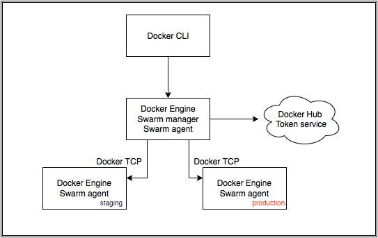

# What is Compose
- Defining and running multi-container applications
- Using a Compose file (docker-compose.yml)


!SUB
# Compose overview


!SUB
# Compose capabilities
- Multiple isolated environments on single host
- Preserve volume data when containers are created
- Only recreate containers that have changed
- Using variables and extending Compose files

!SUB
# Compose file
- docker-compose.yml
- Run it using ```docker-compose up```

```
web:
  build: .
  ports:
   - "5000:5000"
  volumes:
   - .:/code
  links:
   - redis
redis:
  image: redis
```

!SUB
# Exercise
- Create a docker-compose.yml to launch a nodejs container and a redis backend

!SLIDE
# What is Swarm
- Native clustering for Docker
- Compatible with Docker remote API


!SUB
# Swarm overview


!SUB
# Swarm capabilities
- Built-in scheduler with filters
  - Node tags
  - Affinity
  - Strategies
- Pluggable node discovery
- Pluggable schedulers

!SUB
# Swarm creation
- Create a unique cluster_id token

```
$ docker run --rm swarm create
6856663cdefdec325839a4b7e1de38e8
```
- Create Swarm nodes

```
docker run -d swarm join --addr=<node_ip:2375> token://<cluster_id>
```
- Create a Swarm manager

```
docker run -d -p <manager_port>:2375 swarm manage token://<cluster_id>
docker -H tcp://<manager_ip:manager_port> info
```

!SLIDE
# Workshop Setup


!SUB
# Prerequisites
- Vagrant
- Virtualbox

!SUB
# Workshop materials
```
vagrant up
```
will provide you a lab environment of 3 nodes which are Docker enabled
```
vagrant ssh ddd-0[1-3]
```

!SUB
# Assignment
Create a working Swarm Cluster of three nodes

!SUB
# Verify

Check if all you cluster nodes are registered
```
docker -H <swarm-ip:port> info
```

!SUB
# Challenge 1
Define a staging and production environment. Use extended services to target an application to both of these environments. Make sure that the running application knows on which environment it is deployed.

!SUB
# Challenge 1: Step 1
Partition your Docker nodes to have one staging and one production environment



[see: filters and constraints](https://docs.docker.com/v1.5/swarm/scheduler/filter)

!SUB
# Challenge 1: Step 2
Create a sample deployment using Docker compose
image: ehazlett/docker-demo

!SUB
# Challenge 1: Step 3
Extend the service in such a way that you have a
- staging.yml
- production.yml

Now deploy the app to both environments

[see: extending services](https://docs.docker.com/compose/extends)

!SUB
# [ Challenge 2 ]
Use an alternate backend for Swarm, for example Consul.

!SUB
# [ Challenge 3 ]
Secure your Swarm Cluster

Enable TLS on all Docker Daemons and your Swarm Manager
